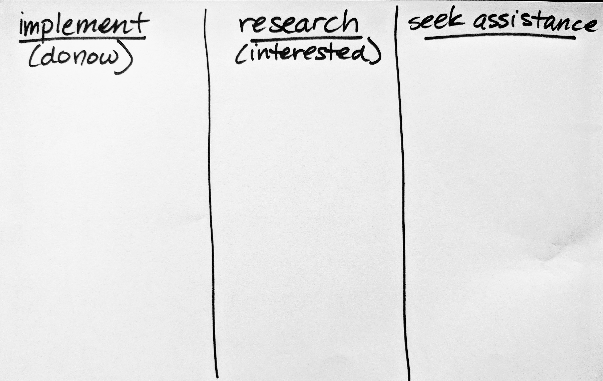
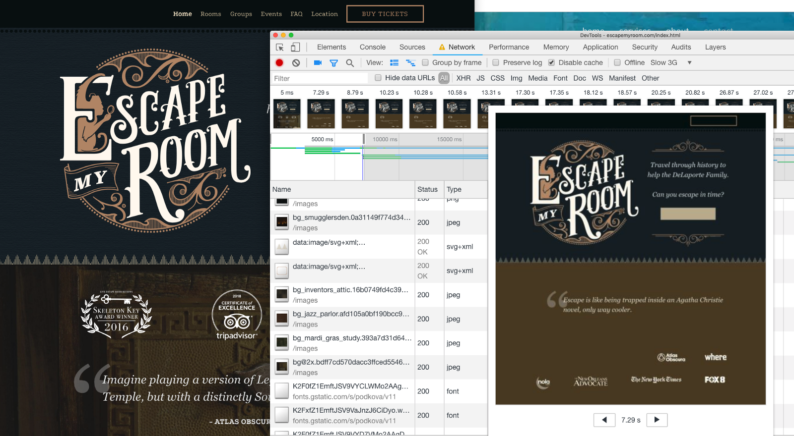

<!-- .slide: data-background="./images/hero_bg.jpg" -->
<h1 class="title dark-background"><span class="translucent">React App</span> Performance Tuning</h1>
<h2 class="subtitle">Jason Lengstorf + Sia Karamalegos</h2>

-v-

## hi, i'm sia


-v-

## hi, i'm jason

-v-

## introduce yourself to your neighbors

Note: Suggest pair programming and give them an opportunity to change seats.

-v-

## Take out a piece of paper...



-v-

<!-- .slide: data-background="./images/elevator2.jpg" -->
<h1 class="dark-background">
  <span class="highlighter">Why do elevators have mirrors?</span>
</h1>

---

# Why Should I Care?

-v-

> Pinterest reduced load times by 40% and saw a 15% increase in sign ups.

<small>https://wpostats.com/</small>

-v-

> Starbucks implemented a 2x faster time to interactive resulting in a 65% increase in rewards registrations.

<small>[Chrome Dev Summit](https://www.youtube.com/watch?v=Xryhxi45Q5M&t=1113s&index=6&list=PLNYkxOF6rcIDjlCx1PcphPpmf43aKOAdF )</small>

-v-

> AliExpress reduced load by 36% and saw a 10.5% increase in orders.

<small>https://wpostats.com/</small>

-v-

> Speed is now used as a ranking factor for mobile searches.

<small>https://developers.google.com/web/updates/2018/07/search-ads-speed</small>

Note: In 2016, Doubleclick by Google released a report saying that 53% of mobile sites are abandoned if pages take longer than 3 seconds to load.

---

# Performance Auditing

Note: Audit the crap site with Lighthouse, webpagetest.org. Build agenda from there.

---

# Optimized, Responsive Images

---

# Resource Hints and Fonts

-v-

## Webfonts

<ul class="plus-minus">
  <li class="plus">Hosted on fast and reliable CDNs</li>
  <li class="plus">Can provide optimized variants based on user's browser</li>
  <li class="minus">Minumum of 2 separate requests</li>
  <li class="minus">Can't use resource hints</li>
  <li class="minus">Doesn't take advantage of HTTP2 multiplexing</li>
  <li class="minus">No control over FOUT or FOIT</li>
</ul>

-v-

## Loading Google Fonts

```html
<link href="https://fonts.googleapis.com/css?family=Muli:400"
      rel="stylesheet">
```


-v-


<small>https://twitter.com/addyosmani/status/743571393174872064?lang=en</small>

Note: pdf version of this is in the replies to this tweet

-v-

## Loading Google Fonts with preconnect to fonts.gstatic.com

```html
<link rel="preconnect" href="https://fonts.gstatic.com/" crossorigin>
<link href="https://fonts.googleapis.com/css?family=Muli:400"
      rel="stylesheet">
```


-v-

## Self-Hosting Fonts

```html
<link as="font" type="font/woff2"
  href="./fonts/muli-v12-latin-regular.woff2" crossorigin>

<link as="font" type="font/woff2"
  href="./fonts/muli-v12-latin-700.woff2" crossorigin>
```

Note: This alone does not fix perf problem.

-v-

## Preloading self-hosted fonts

```html
<link rel="preload" as="font" type="font/woff2"
  href="./fonts/muli-v12-latin-regular.woff2" crossorigin>

<link rel="preload" as="font" type="font/woff2"
  href="./fonts/muli-v12-latin-700.woff2" crossorigin>
```


<small>Note that `preload` loads a resource whether used or not. Only preload resources that are needed on a particular page.</small>

Note: `rel="preload"` tells the browser to declaratively fetch the resource but not “execute” it (our CSS will queue usage). `as="font"` tells the browser what it will be downloading so that it can set an appropriate priority. Without it, the browser would set a default low priority. `type="font/woff2` tells the browser the file type so that it only downloads the resource if it supports that file type. `crossorigin` is required because fonts are fetched using anonymous mode CORS.

-v-

## FOIT



Note: FOIT in action — note the missing navbar text in the filmstrip screenshot (throttled to slow 3G)

-v-

## `font-display`


<small>https://font-display.glitch.me/</small>

Note: add the `font-display` property to the `@font-face` declaration

-v-

## subset

- The [subfont](https://github.com/Munter/subfont) npm package also dynamically subsets your fonts.
- Are you a fan of Gatsby? There’s even a [subfont plugin](https://www.gatsbyjs.org/packages/gatsby-plugin-subfont/) for it.

-v-

# Exercise

<video autoplay loop playsinline muted>
  <source src="/images/hamster.mp4" type="video/mp4">
  Sorry, your browser doesn't support embedded videos.
</video>

---

# Service Workers for Performance

---

# Third-Party Scripts

---

# Code Splitting and Bundle Optimization

---

# Lazy Loading

---

# Perceived Performance

Note: Using psychology to make an app feel faster than it actually is

-v-

<!-- .slide: data-background="./images/baggage_claim.jpg" -->
<h1 class="dark-background">
  <span class="highlighter">Houston's Baggage Claim Complaints</span>
</h1>

<small>http://www.nytimes.com/2012/08/19/opinion/sunday/why-waiting-in-line-is-torture.html</small>

Note: “Often the psychology of queuing is more important than the statistics of the wait itself,” notes the M.I.T. operations researcher Richard Larson. Occupied time (walking to baggage claim) feels shorter than unoccupied time (standing at the carousel).

---

> Are you better off making the site load faster or ensuring that users complete their tasks?

<small>Christine Perfetti, [The Truth About Download Time](https://articles.uie.com/download_time/) 2006</small>

---

<!-- .slide: data-background="./images/hero_bg.jpg" -->
<h1 class="title dark-background">Thanks!</h1>
Slides, resources, and more at <a href="https://bit.ly/siaspeaks" class="dark-background">bit.ly/siaspeaks</a>

