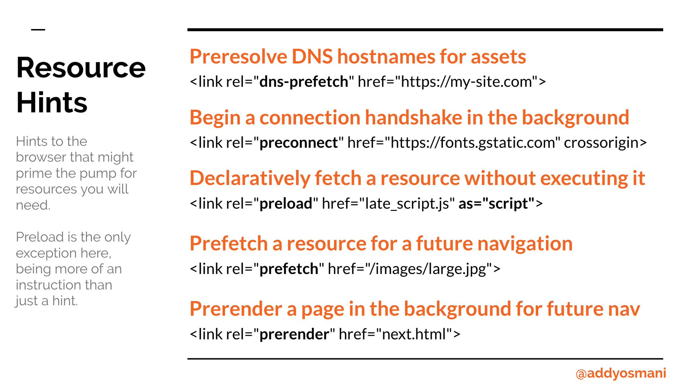
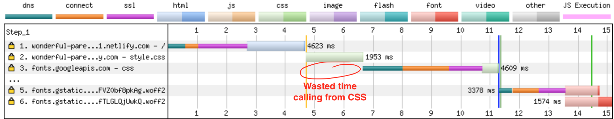
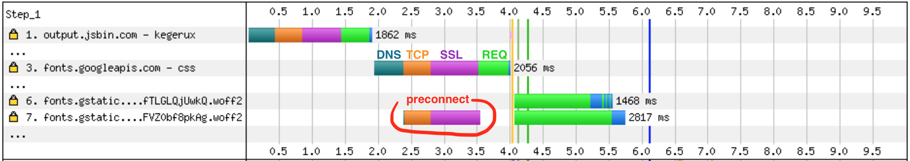
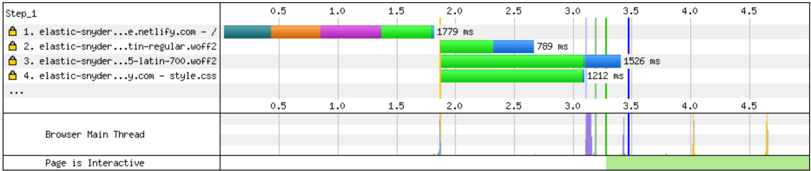

<!-- .slide: data-background-color="#673399" -->
<h1 class="title dark-background"><span class="translucent">Advanced React</span> Performance</h1>
<h2 class="subtitle">Jason Lengstorf + Sara Vieira <br>+ Sia Karamalegos</h2>

---

## Meet today’s teachers

- Sara Vieira ([@NikkitaFTW](https://twitter.com/NikkitaFTW))
- Jason Lengstorf ([@jlengstorf](https://twitter.com/jlengstorf))

---


## Coding is more fun with friends

- 👋 Introduce yourself to your neighbors <!-- .element: class="fragment" -->
- 👯‍♀️ Pair programming is a great option! <!-- .element: class="fragment" -->
- 💬 Ask lots of questions <!-- .element: class="fragment" -->

Note: Suggest pair programming and give them an opportunity to change seats.

---

## Let’s look at our app

https://git.io/advanced-react-perf

---

## Why’s my app so slow?

Let’s debug it! <!-- .element: class="fragment" -->

---

## Step 0: Understand the problems

- Analyze the app assets <!-- .element: class="fragment" -->
- Look at performance audit reports <!-- .element: class="fragment" -->
- Identify opportunities to improve <!-- .element: class="fragment" -->
- Prioritize the list using an impact vs. effort matrix <!-- .element: class="fragment" -->
- Make a plan of action! <!-- .element: class="fragment" -->

---

## Contents

1. Lazy-loading resource and components
2. Caching with service workers
3. Latency and resource hints
4. Optimizing images
5. Script execution costs
6. Perceived performance

---

# Lazy-loading resources and components

---

# Caching with service workers

---


<small>[Docs](https://developers.google.com/web/tools/workbox/)</small>

---

# Latency and resource hints

---


<small>https://twitter.com/addyosmani/status/743571393174872064?lang=en</small>

Note: pdf version of this is in the replies to this tweet

---

## Latency Case Study: Fonts

```css
@import url('https://fonts.googleapis.com/css?family=Open+Sans|Muli');

h1 {
  font-family: 'Open Sans', sans-serif;
}

p {
  font-family: 'Muli', sans-serif;
}
```

---

## Loading Google Fonts from CSS



---

## Loading Google Fonts from HTML

```html
<link href="https://fonts.googleapis.com/css?family=Muli:400"
      rel="stylesheet">
```


---

## Google Fonts with preconnect!

```html
<link rel="preconnect" href="https://fonts.gstatic.com/" crossorigin>
<link href="https://fonts.googleapis.com/css?family=Muli:400"
      rel="stylesheet">
```



---

## Webfonts

<ul class="plus-minus">
  <li class="plus">Hosted on fast and reliable CDNs</li>
  <li class="plus">Can provide optimized variants based on user's browser</li>
  <li class="plus">Opportunity for shared caching on popular fonts</li>
  <li class="minus">Minumum of 2 separate requests</li>
  <li class="minus">Can't use resource hints on the font file</li>
  <li class="minus">Doesn't take advantage of HTTP2 multiplexing</li>
  <li class="minus">No control over FOUT or FOIT</li>
</ul>

---

## Self-hosted fonts

```html
<link as="font" type="font/woff2"
  href="./fonts/muli-v12-latin-regular.woff2" crossorigin>

<link as="font" type="font/woff2"
  href="./fonts/muli-v12-latin-700.woff2" crossorigin>
```


Note: This alone does not fix perf problem.

---

## Preloading self-hosted fonts

```html
<link rel="preload" as="font" type="font/woff2"
  href="./fonts/muli-v12-latin-regular.woff2" crossorigin>

<link rel="preload" as="font" type="font/woff2"
  href="./fonts/muli-v12-latin-700.woff2" crossorigin>
```



<small>Note that `preload` loads a resource whether used or not. Only preload resources that are needed on a particular page. Don't self-host popular webfonts like Open Sans or Roboto (sabotages caching).</small>

Note: `rel="preload"` tells the browser to declaratively fetch the resource but not “execute” it (our CSS will queue usage). `as="font"` tells the browser what it will be downloading so that it can set an appropriate priority. Without it, the browser would set a default low priority. `type="font/woff2` tells the browser the file type so that it only downloads the resource if it supports that file type. `crossorigin` is required because fonts are fetched using anonymous mode CORS.

---

# Optimizing images

---

## Want a mini-course in responsive images?

File formats, `srcset`'s, and `<picture>`'s, oh my!

https://siakaramalegos.github.io/responsive-images-slides/#/

---

# Script execution costs

---

# Perceived performance

---

<!-- .slide: data-background-color="#673399" -->
<h1 class="title dark-background">Thanks!</h1>
<!-- Slides, resources, and more at <a href="https://bit.ly/siaspeaks" class="dark-background">bit.ly/siaspeaks</a> -->
