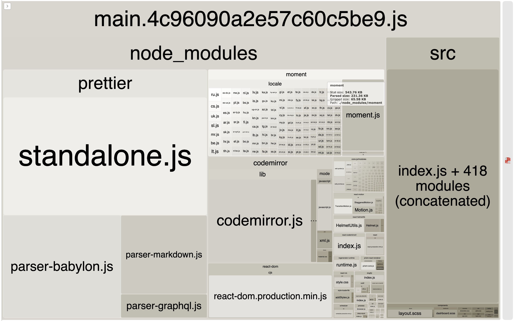

<!-- .slide: data-background-color="#673399" -->
<h1 class="title dark-background"><span class="translucent">Advanced React</span> Performance</h1>
<h2 class="subtitle">Jason Lengstorf + Sara Vieira <br>+ Sia Karamalegos</h2>

---

## Meet today’s teachers

- Sara Vieira ([@NikkitaFTW](https://twitter.com/NikkitaFTW))
- Jason Lengstorf ([@jlengstorf](https://twitter.com/jlengstorf))

---


## Coding is more fun with friends

- 👋 Introduce yourself to your neighbors <!-- .element: class="fragment" -->
- 👯‍♀️ Pair programming is a great option! <!-- .element: class="fragment" -->
- 💬 Ask lots of questions <!-- .element: class="fragment" -->

Note: Suggest pair programming and give them an opportunity to change seats.

---

## Let’s look at our app

https://git.io/advanced-react-perf

---

## Why’s my app so slow?

Let’s debug it! <!-- .element: class="fragment" -->

---

# Understand the problems

- Analyze the app assets <!-- .element: class="fragment" -->
- Look at performance audit reports <!-- .element: class="fragment" -->
- Identify opportunities to improve <!-- .element: class="fragment" -->
- Prioritize the list using an impact vs. effort matrix <!-- .element: class="fragment" -->
- Make a plan of action! <!-- .element: class="fragment" -->

---

## Analyze the app

[`webpack-bundle-analyzer`](https://github.com/webpack-contrib/webpack-bundle-analyzer)

---



---

# Things to fix

1. Low-hanging fruit <!-- .element: class="fragment" -->
2. Code splitting <!-- .element: class="fragment" -->
3. Refactoring dependencies <!-- .element: class="fragment" -->
4. Improve font loading <!-- .element: class="fragment" -->
5. Caching with service workers <!-- .element: class="fragment" -->
6. Perceived performance and lazy loading <!-- .element: class="fragment" -->
7. Optimizing images <!-- .element: class="fragment" -->

---

# Low-hanging fruit

- Use production bundles <!-- .element: class="fragment" -->
- Extract CSS into separate bundles <!-- .element: class="fragment" -->
- Compress and minify CSS <!-- .element: class="fragment" -->
- Set browser targets for Babel <!-- .element: class="fragment" -->
- Generate compressed bundles <!-- .element: class="fragment" -->
- Disable source maps in production <!-- .element: class="fragment" -->

---

## Use production bundles

```diff
  {
    ...
    "scripts": {
      "start": "NODE_ENV=development webpack-dev-server",
-     "build": "webpack"
+     "build": "webpack -p"
    },
    ...
  }
```

<small>See also: [the webpack docs for production builds](https://webpack.js.org/guides/production/)</small>

---

### What production mode does:

1.  Sets `NODE_ENV` to `production`, which triggers smaller builds of some libraries
2.  Turns on script minification with Terser

---

## Extract CSS to its own bundles

[`mini-css-extract-plugin`](https://github.com/webpack-contrib/mini-css-extract-plugin)

---

## Compress and minify CSS

[`optimize-css-assets-webpack-plugin`](https://github.com/NMFR/optimize-css-assets-webpack-plugin)

---

## Set browser targets for Babel

Create a `.browserslistrc`

```
last 2 versions	
> 0.2%	
not dead
```

<small>See also: [the Browserslist docs](https://github.com/browserslist/browserslist)</small>

---

## Generate compressed bundles

[`compression-webpack-plugin`](https://github.com/webpack-contrib/compression-webpack-plugin)

---

## Disable source maps in production

```diff
  module.exports = {
    ...
-   devtool: 'source-map',
+   devtool: process.env.NODE_ENV === 'production' ? 'none' : 'source-map',
    ...
};

```

---

# Code splitting

- Use dynamic imports for large dependencies <!-- .element: class="fragment" -->
- Lazy load React components <!-- .element: class="fragment" -->

<small>Protip: don’t forget to add chunk names for easier analysis!</small> <!-- .element: class="fragment" -->

---

## Use dynamic imports for large dependencies

```diff
- import thing from 'packagename';
+ import('packagename' /* webpackChunkName: "packagename" */)
+   .then(thing => {
+     // do stuff with the module here
+   })
```

<small>See also: [the webpack docs on dynamic imports](https://webpack.js.org/guides/code-splitting#dynamic-imports)</small>

---

## Lazy load React components

```jsx
// Before
import React from 'react';
import Foo from '../../pages/foo';

export default () => <Foo />;
```
```jsx
// After
import React, { lazy, Suspense } from 'react';
const Foo = lazy(() =>
  import('../../pages/foo' /* webpackChunkName: "foo" */)
);

export default () => (
  <Suspense fallback={<p>Loading...</p>}>
    <Foo />
  </Suspense>
)
```

<small>See also: [the React docs on React.lazy and Suspense](https://reactjs.org/docs/code-splitting.html#reactlazy)</small>

---

# Refactor dependencies

- Use smaller dependencies when available <!-- .element: class="fragment" -->
- Only import what is actually used <!-- .element: class="fragment" -->
- Remove heavy dependencies for most users when possible <!-- .element: class="fragment" -->

---

## Use smaller dependencies


<small>See also: [BundlePhobia](https://bundlephobia.com/result?p=moment@2.24.0)</small>

---

### Only import what is actually used

```javascript
// Big
import _ from 'lodash';
_.isEmpty({});

// Big
import { isEmpty } from 'lodash';

// Little
import isEmpty from 'lodash/isEmpty';

// Big
import moment from 'moment';

// Little
import { addMinutes } from 'date-fns';
```

<small>Use Moment? Try [date-fns](https://date-fns.org/) instead.</small>

---

## Remove heavy dependencies for most users

- Why are we running Prettier on every page load?! <!-- .element: class="fragment" -->

---

# Improve font loading

- Use HTML to load Google fonts <!-- .element: class="fragment" -->
- Preconnect to remote font origins <!-- .element: class="fragment" -->
- Use `font-display: swap` for local fonts <!-- .element: class="fragment" -->
- Preload local fonts when appropriate <!-- .element: class="fragment" -->

---


<small>Source: [Addy Osmani](https://twitter.com/addyosmani/status/743571393174872064)</small>

Note: pdf version of this is in the replies to this tweet

---

## Latency Case Study: Fonts

```css
@import url('https://fonts.googleapis.com/css?family=Open+Sans|Muli');

h1 {
  font-family: 'Open Sans', sans-serif;
}

p {
  font-family: 'Muli', sans-serif;
}
```

---

## Loading Google Fonts from CSS


---

## Loading Google Fonts from HTML

```html
<link href="https://fonts.googleapis.com/css?family=Muli:400"
      rel="stylesheet">
```


---

## Google Fonts with preconnect

```html
<link rel="preconnect" href="https://fonts.gstatic.com/" crossorigin>
<link href="https://fonts.googleapis.com/css?family=Muli:400"
      rel="stylesheet">
```


---

## Self-hosted fonts

```html
<link as="font" type="font/woff2"
  href="./fonts/muli-v12-latin-regular.woff2" crossorigin>

<link as="font" type="font/woff2"
  href="./fonts/muli-v12-latin-700.woff2" crossorigin>
```


Note: This alone does not fix perf problem.

---

## Preloading self-hosted fonts

```html
<link rel="preload" as="font" type="font/woff2"
  href="./fonts/muli-v12-latin-regular.woff2" crossorigin>

<link rel="preload" as="font" type="font/woff2"
  href="./fonts/muli-v12-latin-700.woff2" crossorigin>
```


<small>Note that `preload` loads a resource whether it’s used or not.</small>

Note: `rel="preload"` tells the browser to declaratively fetch the resource but not “execute” it (our CSS will queue usage). `as="font"` tells the browser what it will be downloading so that it can set an appropriate priority. Without it, the browser would set a default low priority. `type="font/woff2` tells the browser the file type so that it only downloads the resource if it supports that file type. `crossorigin` is required because fonts are fetched using anonymous mode CORS.<br>Only preload resources that are needed on a particular page. Don’t self-host popular webfonts like Open Sans or Roboto (sabotages caching).

---

# Caching with service workers

- Set up the Workbox webpack plugin <!-- .element: class="fragment" -->
- Load the Service Worker in index.html <!-- .element: class="fragment" -->
- Ignore vendor bundles during precaching <!-- .element: class="fragment" -->
- Set up runtime caching for vendor bundles <!-- .element: class="fragment" -->
- Set up runtime caching for external resources <!-- .element: class="fragment" -->

---


[`workbox-webpack-plugin`](https://www.npmjs.com/package/workbox-webpack-plugin)

<small>See also: [the Workbox docs](https://developers.google.com/web/tools/workbox/)</small>

---

## Add the Service Worker in index.html

```diff
  <!DOCTYPE html>
  <html lang="en">
    <head>
      <!-- ... -->
    </head>
    <body>
      <noscript>This site only works with JavaScript enabled. :(</noscript>
      <div id="root"></div>
+     <script>
+       if ('serviceWorker' in navigator) {
+         window.addEventListener('load', () => {
+           navigator.serviceWorker.register('/service-worker.js');
+         });
+       }
+     </script>
    </body>
  </html>
```

---

### Something’s not right...

We’re precaching an awful lot. <!-- .element: class="fragment" -->

Note: Check the network tab to see how much is being precached.

---

## Ignore vendor bundles

```diff
  new GenerateSW({
    cacheId: 'shame-dev',
    clientsClaim: true,
    skipWaiting: true,
+   exclude: [/vendor/],
  })
```

<small class="fragment">But we _do_ want to cache them if they’re used...</small>

---

## Set up runtime caching for vendor bundles

```diff
  new GenerateSW({
    cacheId: 'shame-dev',
    clientsClaim: true,
    skipWaiting: true,
    exclude: [/vendor/],
+   runtimeCaching: [
+     {
+       urlPattern: /vendor/,
+       handler: 'CacheFirst'
+     },
+   ]
  })
```

---

## Add runtime caching for external resources

```diff
    runtimeCaching: [
      {
        urlPattern: /vendor/,
        handler: 'CacheFirst'
      },
+     {
+       urlPattern: new RegExp('^https://fonts.googleapis.com/'),
+       handler: 'StaleWhileRevalidate',
+       options: {
+         cacheableResponse: {
+           statuses: [0, 200]
+         }
+       }
+     }
    ]
```

---

# Perceived performance

- Don’t wait for the slowest load to render things <!-- .element: class="fragment" -->

Note: Refactor the dashboard to load metrics inside the chart.<br>
Use Suspense to load the chart.

---

# Optimize images

- That header is... too big <!-- .element: class="fragment" -->
- Use the right image format <!-- .element: class="fragment" -->
- Add a srcset <!-- .element: class="fragment" -->

---

## Make the images as small as possible

- Use [SVGO](https://github.com/svg/svgo) to optimize SVGs
- Use [TinyPNG](https://tinypng.com) to optimize JPGs and PNGs

<small>Protip: Both of these tools are available as webpack loaders.</small>

Note: SVGO is built into the React svg loader we’re using. TinyPNG requires an API key for the webpack loader, which is why we’re not setting it up in the workshop.

---

## Choose the right image format

- PNG if you need transparency or ultra high quality
- JPG for pretty much everything else

<small>Protip: use [WebP](https://developers.google.com/speed/webp/) when you can, but [check browser support](https://caniuse.com/#search=webp).</small>

---

## Use a srcset

- Create multiple sizes of the image for different viewports
- Let the browser do the work

<small class="fragment">We forgot to create the assets for this, so... we’re not going to do it today. 😅</small>

---

## Want a mini-course in responsive images?

Check out Sia Karamalegos’s  
[_File formats, `srcset`'s, and `<picture>`'s, oh my!_](https://siakaramalegos.github.io/responsive-images-slides/#/)

---

<!-- .slide: data-background-color="#673399" -->
<h1 class="title dark-background">Thanks!</h1>
<!-- Slides, resources, and more at <a href="https://bit.ly/siaspeaks" class="dark-background">bit.ly/siaspeaks</a> -->
